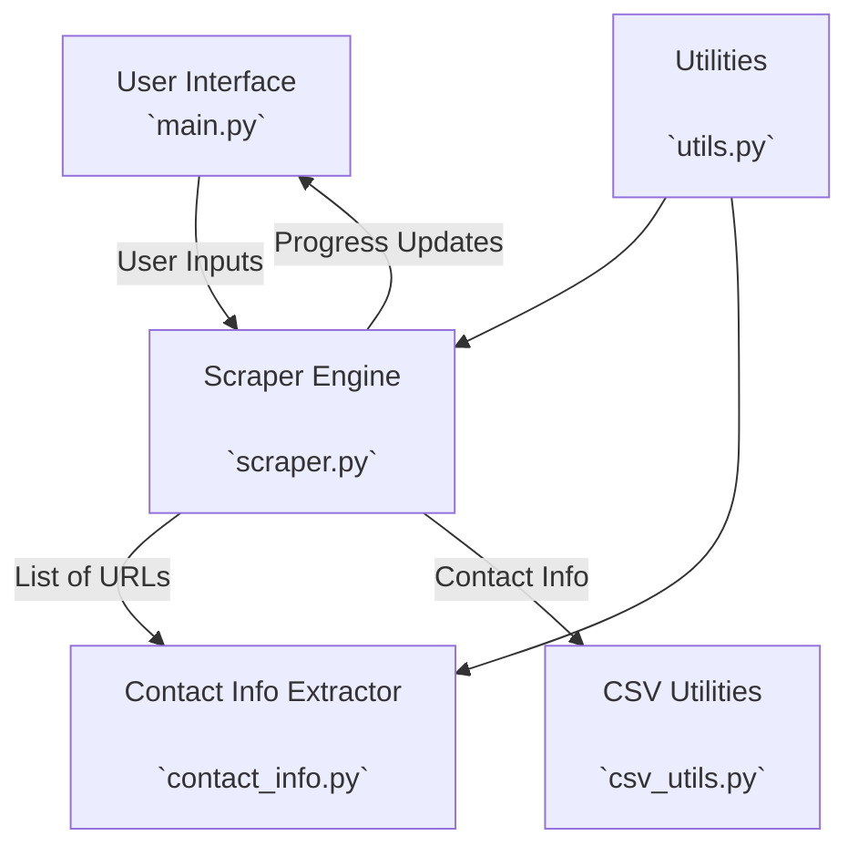

# Project Overview
    The original GMaps Scraper will be refactored into separate, modular components that can be easily reused in different projects or scenarios.
    
    Additionally, the tool will be updated to accept a list of website URLs as input and output a CSV file containing specific contact information.

## Features
- Add a list of website URLs to the GUI.
- Scrape Contact Information (Name, Email, Job Title)
- Validate 

#### New Modules:
- `GoogleSearch:` Handles Google search queries (if needed in future iterations).
- `ContactInfoExtractor:` Identifies, Extracts & Cleans contact information from web pages.
- `CSVUtils:` Manages CSV operations (reading, writing, deduplication).
- `EmailUtils:` Handles email sending functionality (if needed in future iterations).
- `Utils:` Provides utility functions (e.g., loading environment variables, setting up Selenium WebDriver).

## Components
### Component Diagram:

### Main Application (main.py)
- Manages the GUI and functionality.
- Initiates the `ScraperEngine`

### Asynchronous Scrape Engine (scraper.py)
- Orchestrates the overall scraping process.
- Scrapes multiple websites at the same time.
- Interacts w/ other modules to initiate tasks:
    - extract - `ContactInfoExtracter`
    - validate - `DataValidator`
    - store -  `csv_utils`

### Contact Info Extractor (contact_info.py)
- holds the `ContactInfoExtracter` class
- Takes a webpage as input and extracts relevant data about people (Names, Emails, Job-Titles)
- Extracting important information about people.

### Data Validator (validate_data.py)
- The `DataValidator`class validates the information collected by `ContactInfoExtracter`.
- Verifies accuracy of collected data before writing to a csv.

### CSV Utilities (csv_utils.py)
- Reads and writes contact information to/from CSV files.
- Handles deduplication of entries.

### Utilities (utils.py)
- Loads environment variables.
- Handles setup/config of Selenium WebDriver (when needed)