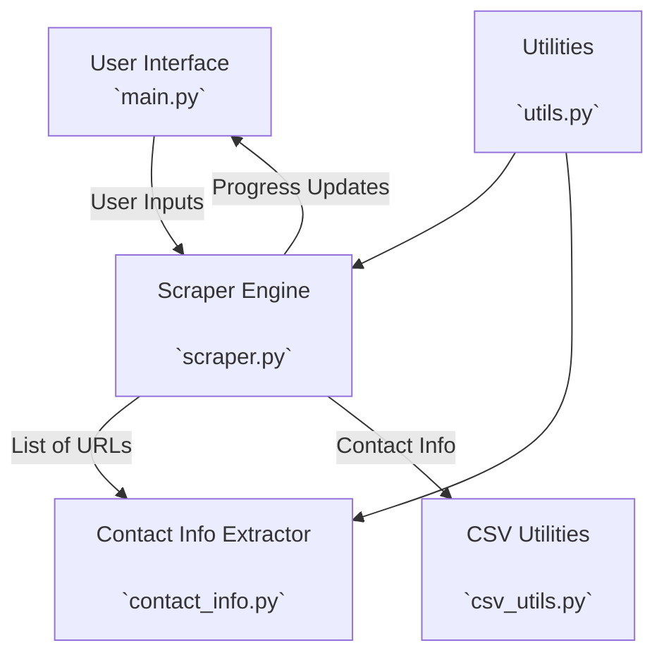

# Project Overview
    The original GMaps Scraper will be refactored into separate, modular components that can be easily reused in different projects or scenarios.
    
    Additionally, the tool will be updated to accept a list of website URLs as input and output a CSV file containing specific contact information.

## Features
    Modular Architecture: The scraping tool will be refactored into separate, reusable modules.
### New Modules:
- `GoogleSearch:` Handles Google search operations (if needed in future iterations).
- `ContactInfoExtractor:` Extracts contact information from web pages.
- `CSVUtils:` Manages CSV operations (reading, writing, deduplication).
- `EmailUtils:` Handles email sending functionality (if needed in future iterations).
- `Utils:` Provides utility functions (e.g., loading environment variables, setting up Selenium WebDriver).

## Components
### Component Diagram:

### Main Application (main.py)
- Manages the GUI and user interactions.
- Initiates the scraping process using the ScraperEngine.

### Scraper Engine (scraper.py)
- Orchestrates the overall scraping process.
- Utilizes other modules for specific tasks (extracting, writing).

### Contact Info Extractor (contact_info.py)
- Extracts email and other contact information from web pages.
- Ensures the information is valid and relevant.

### CSV Utilities (csv_utils.py)
- Reads and writes contact information to/from CSV files.
- Handles deduplication of entries.

### Utilities (utils.py)
- Loads environment variables.
= Sets up and configures the Selenium WebDriver.

